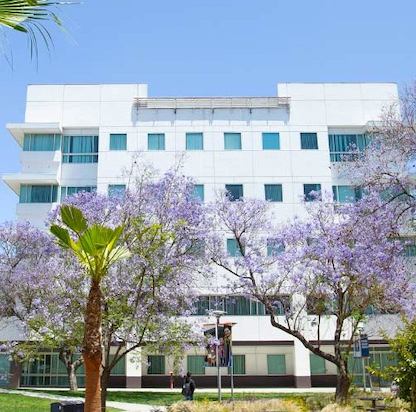
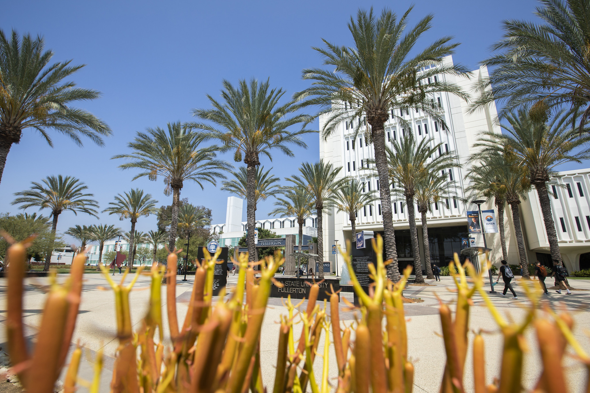

 New Student Orientation

 Public Administration Majors

Summer 2023

 
---

## We're Glad You're Here!

#####  Welcome to Cal State Fullerton and the Public Administration Major

	
 

   

     <ul>
       <li>You made a great choice by coming to CSUF</li>
       <li>College graduates with critical thinking and analytical skills have many possibilities in a quickly changing world</li>
     </ul>
   

 

  

    
  

---

 Why Public Administration?

- PA is the study of the management of government at all levels &mdash; local, state, and federal &mdash; as well as nonprofit organizations

- Serve your community and make a change by learning about:

<table class="reveal">
  <tbody>
    <tr>
      <td>Leadership skills</td>
      <td>Public policy</td>
    </tr>
    <tr>
      <td>Human resources</td>
      <td>Communication</td>
    </tr>
    <tr>
      <td>Budgeting &amp; finance</td>
      <td>Data analysis</td>
    </tr>
    <tr>
      <td>Law</td>
      <td>Governance</td>
    </tr>
  </tbody>
</table>

---

Why Public Administration?

- Most of our public administration graduates work in local government &mdash; city, county, and special districts

- Many also work for nonprofits, as well as in state and federal governments

---

 In Your First Year

<h3>Take POSC 100 - American Government</h3>

This class is part of General Education, but take it as soon as possible.

In Fall 2023, take the section <strong>just for majors</strong>:

<ul>
<li><strong>POSC 100-08 (#<code>17906</code>)</strong></li>
<li>It's "invisible," so just use the code <code>17906</code></li>
</ul>

---

 Courses in Your First Year

 
    <table>
        <tr>
            <th>Course/Requirement</th>
            <th>Details</th>
        </tr>
        <tr>
            <td>POSC 100</td>
            <td>"Graduation requirement"</td>
        </tr>
        <tr>
            <td>A.2</td>
            <td>Suggested ENGL course</td>
        </tr>
        <tr>
            <td>B.4</td>
            <td>MATH 120 (Statistics)</td>
        </tr>
        <tr>
            <td>A.3 (Optional)</td>
            <td>PHIL 106 (For law school interest)</td>
        </tr>
    </table>

   Four-Year Roadmap: <a href="https://www.fullerton.edu/academicprograms/academic-roadmaps/2023-24/hss/pbad.php">Link here</a>      

---

 Overview of the Major

   Check out our website with detailed information for majors: <a href="http://hss.fullerton.edu/paj/PublicAdministration/pub_admin_un_major.aspx">Link here</a>      

---

 Overview of the Major

  Catalog Information   Requirements for the major: <a href= "https://catalog.fullerton.edu/preview_program.php?catoid=80&poid=38327&hl=%22public+administration%22&returnto=search">Link here</a>   

---

 The Major and GE

- When you take POSC 320 &mdash; Intro to Public Administration &mdash; it meets GE D.4

- Use Related Fields to meet other GE upper-division requirements

---
Additional Opportunities

  

    <ul>
      <li>Pi Alpha Alpha Global Honor Society</li>
      <li>Internships
        <ul>
          <li>Cal State DC</li>
          <li>Sacramento Semester</li>
        </ul>
      </li>
      <li>100s of Student Organizations on Campus</li>
      <li>Many student worker positions</li>
    </ul>
  

  

    
  

---

 Advising

- At least once a year to make sure you're on track to graduate

- Division advising page with information on appointments:
    - [https://hss.fullerton.edu/paj/academic_adv.aspx](https://hss.fullerton.edu/paj/academic_adv.aspx)
    
- College advising through the Student Success Center:
    - [https://hss.fullerton.edu/student_success_team/](https://hss.fullerton.edu/student_success_team/)
   
   
   ---

---
 Tips for Success

  

    <ul>
      <li style="font-size: 1.5em;"><strong>You got this!</strong></li>
      <li>Figure out a space that works for you to study and do your work</li>
      <li>Use a calendar with your due dates and assignments</li>
      <li>Use Canvas tools for calendar</li>
      <li>Be self-disciplined and keep up with your classes</li>
    </ul>
  

  

    
    
  

---

 Tips for Success

  

    <ul>
      <li style="font-size: 2em;"><strong>GO TO CLASS!!!</strong></li>
      <li>Carefully read each syllabus</li>
     <li>Look carefully through syllabi and assignments for answers to your questions</li>
      <li>Complete assignments, including assigned readings</li>
      <li>Many student worker positions</li>
    </ul>
  

  

    
  

---
  
 More Tips for Success
<ul>
	<li>Get to know your professors</li>
<ul>
  <li>Office hours are for drop-in questions and discussions</li>
  <li>Make appointments to meet at other times</li>
</ul>

<li>Reach out to professors or advisors as soon as you run into any difficulties</li>
<ul>
  <li>We're here to help you succeed, so let us know what you need!</li>
</ul>
</ul>

---

  
  More Tips for Success
 

  

Find classmates, make friends, join a classroom Discord to stay in touch with other students in the major
  

  

    
  

---

 You'll do great!

- Feel free to contact me:
    - David P. Adams, Ph.D.
    - `dpadams@fullerton.edu`
   
- Or contact the Division's general email:
    - `pajdiv@fullerton.edu`
	
---

 Welcome to 

---
